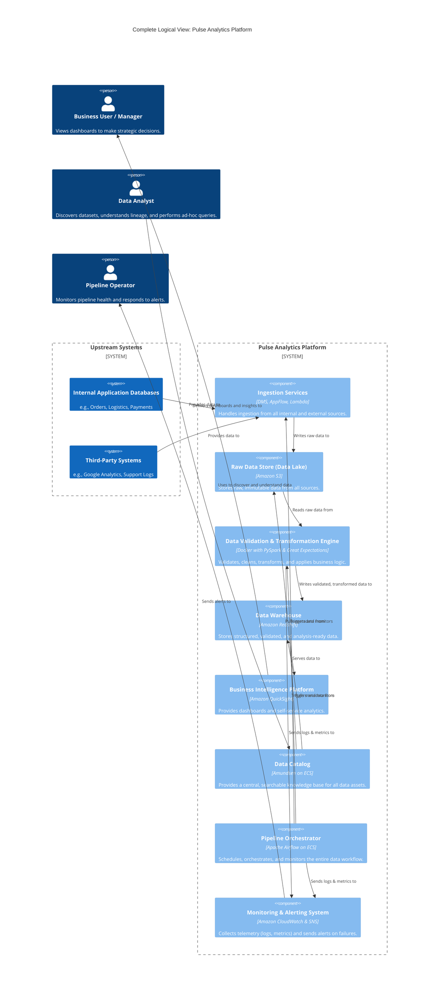
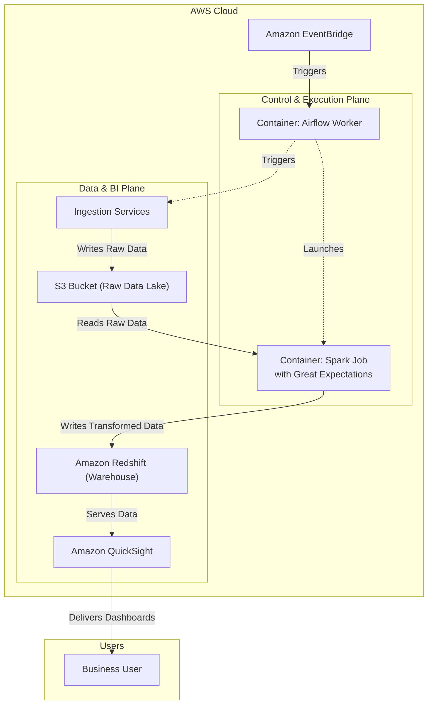
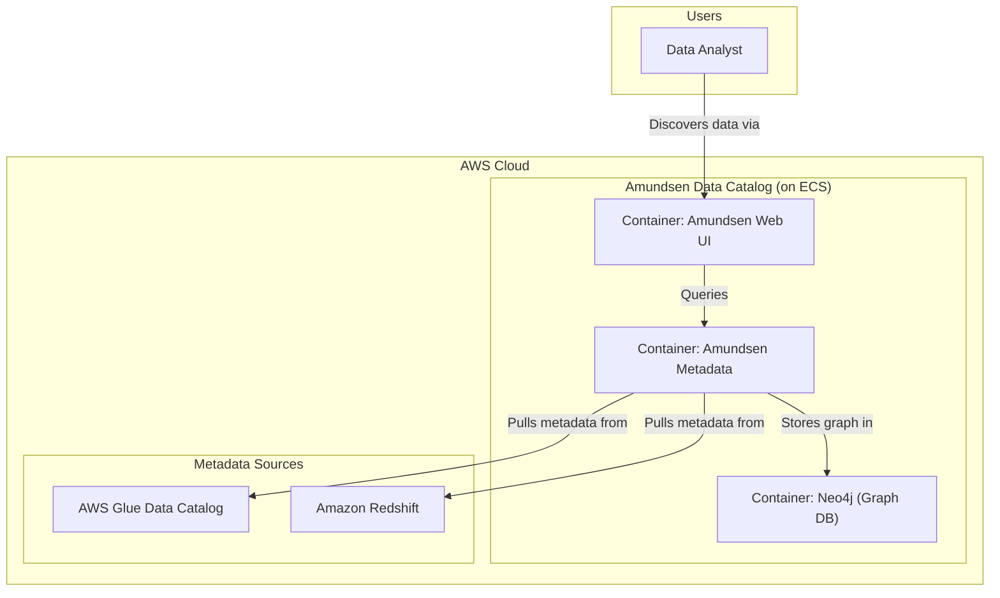

# Pulse Analytics

This is requirements of system design for Data Pipelines

### In a food delivery platform, management would like dashboards summarising key user metrics such as conversion funnels from marketing campaigns, orders, and key logistics metrics such as delivery time end to end

- From separate application systems: orders, logistics, promotions, payments
- Third party vendor data such as customer support logs, Google Analytics, photos

### Performance targets

- Throughput: data volume of x TB raw data daily, to be completed in 6 hours from start to finish
- Latency
- Error rate
- Alerts and pipeline monitoring
- Budget of $xk monthly

### Issue:

- Decentralised analytics: everyone pulls their own data and does their own transformation and
- visualisation
- No central knowledge base / definitions of key metrics

### **Complete Logical View: C4 Component Diagram**

This diagram consolidates all the logical components and their interactions that we designed throughout the process. It illustrates the four primary information flows within the system:

1.  **Primary Data Flow:** The main path for business data, from sources to the data warehouse.
2.  **Control Flow:** How the orchestrator manages and triggers the data processing tasks.
3.  **Metadata Flow:** How the data catalog discovers and indexes information about the data.
4.  **Monitoring Flow:** How the platform is observed and how operators are alerted to problems.

#### **Complete Physical View: AWS Deployment Diagram**

#### **View 1: The Core Data Flow (For Data Engineers)**

This view focuses exclusively on the main data pipeline, showing how business data moves from source to analytics.

#### **View 2: The Data Discovery Flow (For Data Analysts)**

This view focuses on how an analyst uses the platform, completely hiding the complex data pipeline.

