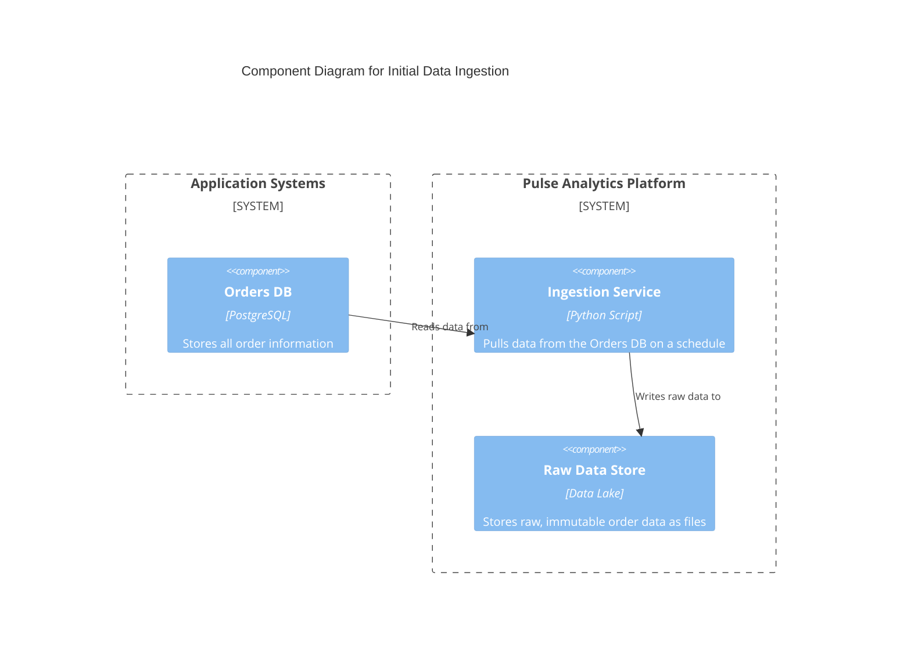
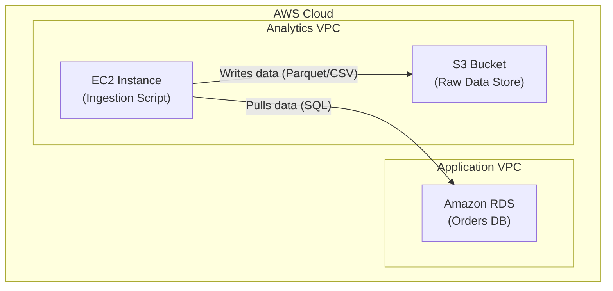

#### **1. Logical View: C4 Component Diagram**

This diagram describes the components of our initial, naive system. It shows the `Orders DB` within the application systems, and within our new `Pulse Analytics Platform`, a simple `Ingestion Service` that moves data to a `Raw Data Store`.

#### **2. Physical View: Mapping to AWS Resources**

This view describes *where* each component from the logical view will run. We are choosing simple, common AWS services to get started quickly.

| C4 Component      | AWS Resource                | Rationale for Selection                                                                   |
| ----------------- | --------------------------- | ----------------------------------------------------------------------------------------- |
| **Orders DB**       | Amazon RDS for PostgreSQL   | A managed relational database service that is likely already in use by the application.   |
| **Ingestion Service** | Python Script on Amazon EC2 | A straightforward and flexible way to start. The script can be run on a schedule (cron). |
| **Raw Data Store**  | Amazon S3 Bucket            | Highly durable, scalable, and cost-effective object storage, ideal for a raw data lake. |

#### **3. Physical View: AWS Deployment Diagram**

This Mermaid diagram provides a visual representation of the physical AWS infrastructure for our initial pipeline.

