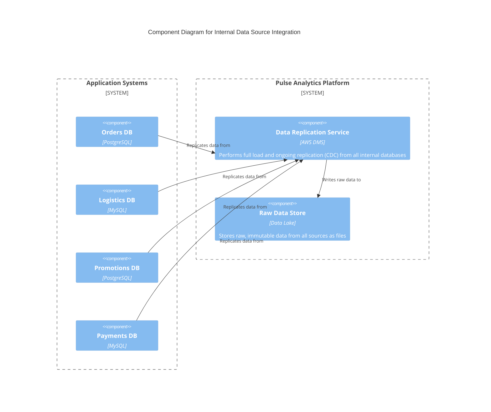
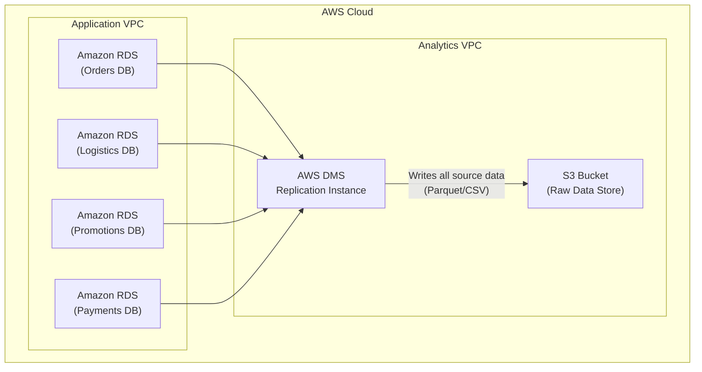

#### **1. Logical View: C4 Component Diagram**

The logical diagram is updated to include the new data sources. The `Ingestion Service` is now evolved into a more capable `Data Replication Service` that handles all internal databases.

#### **2. Physical View: Mapping to AWS Resources**

The EC2 script is now replaced with AWS DMS, a managed service designed for this exact purpose.

| C4 Component                 | AWS Resource                                     | Rationale for Selection                                                                                                   |
| ---------------------------- | ------------------------------------------------ | ------------------------------------------------------------------------------------------------------------------------- |
| **Orders DB**                  | Amazon RDS for PostgreSQL                        | Managed relational database.                                                                                              |
| **Logistics DB**               | Amazon RDS for MySQL                             | Managed relational database.                                                                                              |
| **Promotions DB**              | Amazon RDS for PostgreSQL                        | Managed relational database.                                                                                              |
| **Payments DB**                | Amazon RDS for MySQL                             | Managed relational database.                                                                                              |
| **Data Replication Service**   | AWS Database Migration Service (DMS)             | A managed service that simplifies database migration and replication, reducing operational overhead and improving reliability. |
| **Raw Data Store**             | Amazon S3 Bucket                                 | Highly durable, scalable, and cost-effective object storage for the data lake.                                            |

#### **3. Physical View: AWS Deployment Diagram**

This diagram shows the replacement of the single EC2 instance with a scalable AWS DMS service that connects to all internal application databases.

