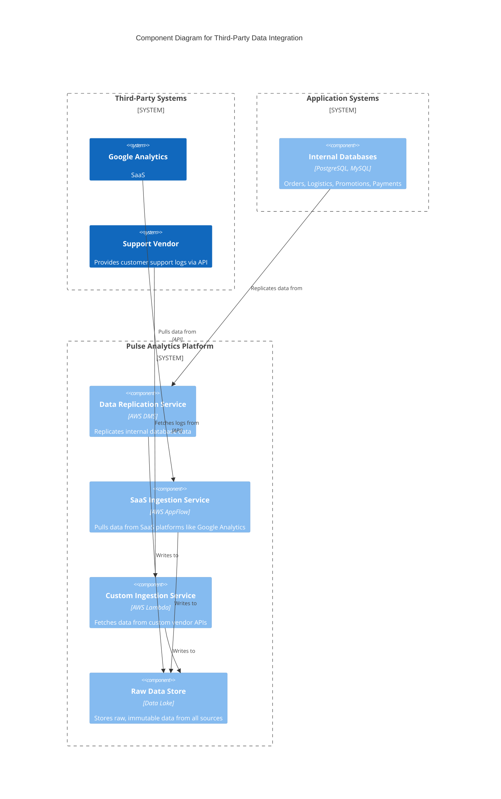
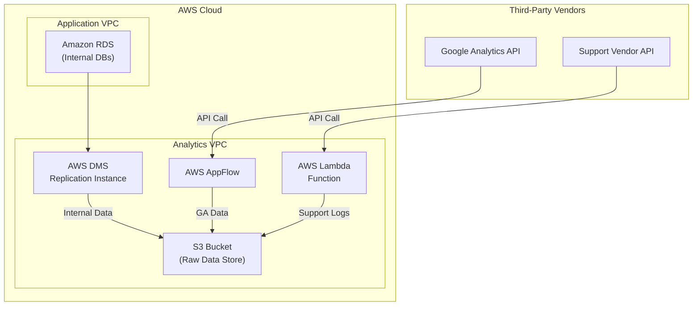

#### **1. Logical View: C4 Component Diagram**

The logical diagram is expanded to show the new external systems and the specialized ingestion components designed to handle them.

#### **2. Physical View: Mapping to AWS Resources**

We add AWS AppFlow and AWS Lambda to our set of services, mapping them to the new logical components.

| C4 Component                 | AWS Resource                                     | Rationale for Selection                                                                                                          |
| ---------------------------- | ------------------------------------------------ | -------------------------------------------------------------------------------------------------------------------------------- |
| **Google Analytics**           | (External SaaS)                                  | A key third-party data source.                                                                                                   |
| **Support Vendor**             | (External SaaS)                                  | Another critical third-party source.                                                                                             |
| **Internal Databases**         | Amazon RDS                                       | Existing managed databases.                                                                                                      |
| **Data Replication Service**   | AWS Database Migration Service (DMS)             | The existing managed service for internal database replication.                                                                  |
| **SaaS Ingestion Service**     | AWS AppFlow                                      | A fully managed integration service with pre-built connectors for SaaS applications, eliminating the need for custom code for GA. |
| **Custom Ingestion Service**   | AWS Lambda                                       | A serverless compute service perfect for running custom, event-driven code to interact with any vendor API without managing servers. |
| **Raw Data Store**             | Amazon S3 Bucket                                 | The central, scalable, and cost-effective data lake.                                                                             |

#### **3. Physical View: AWS Deployment Diagram**

This diagram adds the new ingestion paths for third-party data, showing how they run in parallel with the existing internal data ingestion pipeline.

