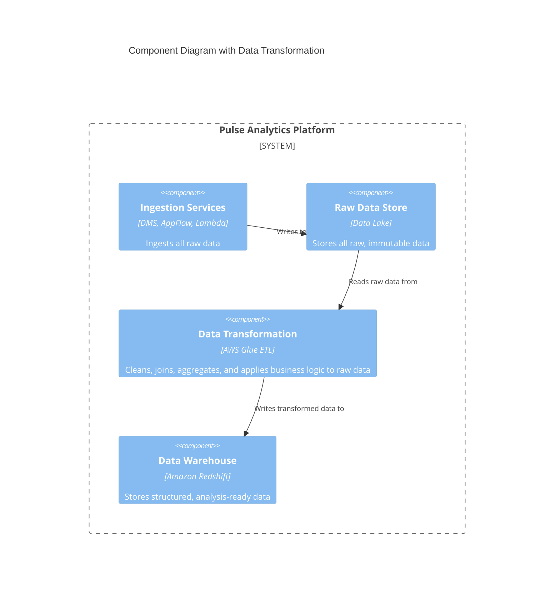
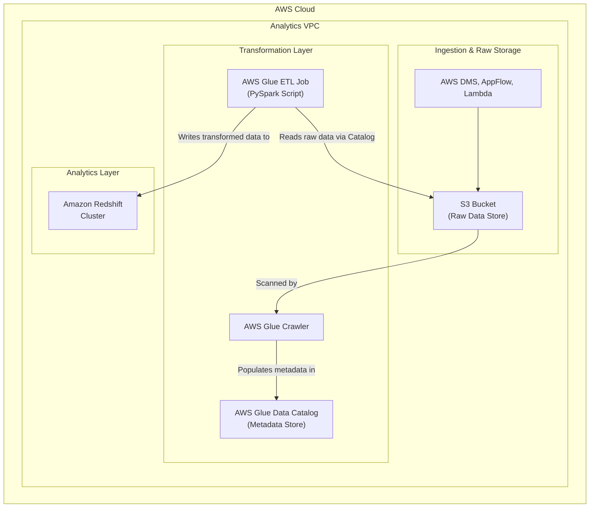

#### **1. Logical View: C4 Component Diagram**

The logical diagram now explicitly shows the `Data Transformation` component, which was only alluded to in the previous issue. This component is the "brain" of our pipeline.

#### **2. Physical View: Mapping to AWS Resources**

We introduce AWS Glue as the primary service for implementing the transformation logic.

| C4 Component                 | AWS Resource                                     | Rationale for Selection                                                                                                                              |
| ---------------------------- | ------------------------------------------------ | ---------------------------------------------------------------------------------------------------------------------------------------------------- |
| **Google Analytics**           | (External SaaS)                                  | A key third-party data source.                                                                                                   |
| **Support Vendor**             | (External SaaS)                                  | Another critical third-party source.                                                                                             |
| **Internal Databases**         | Amazon RDS                                       | Existing managed databases.                                                                                                      |
| **Data Replication Service**   | AWS Database Migration Service (DMS)             | The existing managed service for internal database replication.                                                                  |
| **SaaS Ingestion Service**     | AWS AppFlow                                      | A fully managed integration service with pre-built connectors for SaaS applications, eliminating the need for custom code for GA. |
| **Custom Ingestion Service**   | AWS Lambda                                       | A serverless compute service perfect for running custom, event-driven code to interact with any vendor API without managing servers. |
| **Raw Data Store**             | Amazon S3 Bucket                                 | The central, scalable, and cost-effective data lake.                                                                             |
| **Data Warehouse**             | Amazon Redshift                                  | A fully managed, petabyte-scale cloud data warehouse. Its columnar storage and massive parallel processing (MPP) architecture are ideal for BI and analytics. It integrates seamlessly with S3. |
| **Data Transformation**        | AWS Glue (ETL Jobs, Crawler, Data Catalog)       | A fully managed, serverless ETL service that natively integrates with S3 and Redshift. It uses Apache Spark, enabling large-scale data processing without managing clusters. |

#### **3. Physical View: AWS Deployment Diagram**

This diagram introduces the AWS Glue components, showing how they fit between S3 and Redshift to orchestrate the ETL process.

