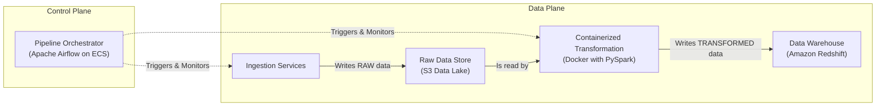
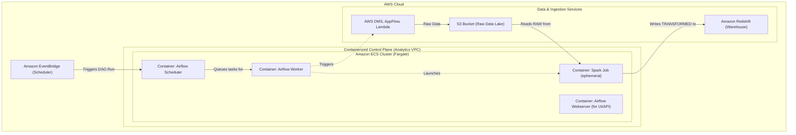

#### **1. Updated Logical View: C4 Component Diagram**

```mermaid
graph LR
    subgraph Control Plane
        Orchestrator["Pipeline Orchestrator<br>(Apache Airflow on ECS)"]
    end

    subgraph Data Plane
        Ingestion["Ingestion Services"]
        RawStore["Raw Data Store<br>(S3 Data Lake)"]
        Transformation["Containerized Transformation<br>(Docker with PySpark)"]
        Warehouse["Data Warehouse<br>(Amazon Redshift)"]
    end

    %% --- Relationships ---

    %% Control Flow
    Orchestrator -. "Triggers & Monitors" .-> Ingestion
    Orchestrator -. "Triggers & Monitors" .-> Transformation

    %% Data Flow
    Ingestion -- "Writes RAW data" --> RawStore
    RawStore -- "Is read by" --> Transformation
    Transformation -- "Writes TRANSFORMED data" --> Warehouse
```

#### **2. Updated Physical View: AWS Deployment Diagram**

```mermaid
graph TD
    subgraph "AWS Cloud"

        %% Control Plane: Self-managed on ECS
        subgraph "Containerized Control Plane (Analytics VPC)"
            subgraph "Amazon ECS Cluster (Fargate)"
                Scheduler["Container: Airflow Scheduler"]
                Worker["Container: Airflow Worker"]
                Webserver["Container: Airflow Webserver (for UI/API)"]
                SparkTask["Container: Spark Job (ephemeral)"]
            end
        end

        %% Data Plane: Managed AWS Services
        subgraph "Data & Ingestion Services"
            Ingestion["AWS DMS, AppFlow, Lambda"]
            S3["S3 Bucket (Raw Data Lake)"]
            Redshift["Amazon Redshift (Warehouse)"]
        end

        %% External Trigger
        EventBridge["Amazon EventBridge (Scheduler)"]

        %% --- Relationships ---

        %% Control Flow
        EventBridge -- "Triggers DAG Run" --> Scheduler
        Scheduler -- "Queues tasks for" --> Worker
        Worker -. "Triggers" .-> Ingestion
        Worker -. "Launches" .-> SparkTask

        %% Data Flow
        Ingestion -- "Raw Data" --> S3
        S3 -- "Reads RAW from" --> SparkTask
        SparkTask -- "Writes TRANSFORMED to" --> Redshift
    end
```