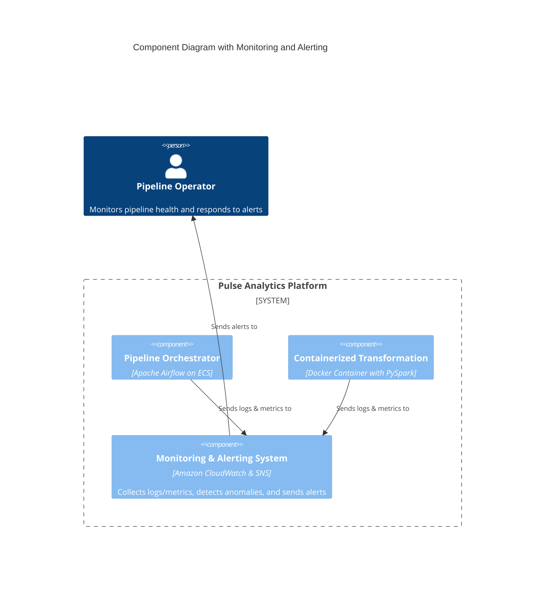
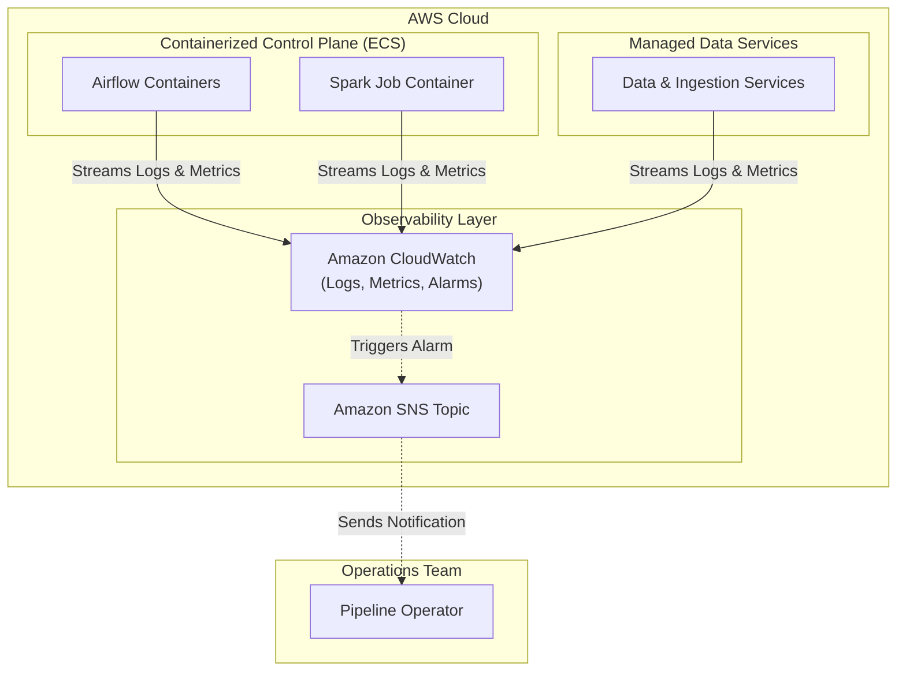

#### **1. Logical View: C4 Component Diagram**

Monitoring is a cross-cutting concern. This diagram shows a `Monitoring System` that observes our platform and notifies the operations team.

#### **2. Physical View: Mapping to AWS Resources**

We are adding the core AWS observability services to our stack.

| C4 Component | AWS Resource | Rationale for Selection |
| :--- | :--- | :--- |
| **Internal Databases** | Amazon RDS | Managed, reliable, and secure database service, likely already in use by the source application systems. |
| **Third-Party Systems** | (External SaaS APIs) | External systems providing data via APIs (e.g., Google Analytics). Not an AWS resource, but a key data source. |
| **Ingestion Services** | AWS DMS, AppFlow, Lambda | A "right tool for the job" approach: DMS for managed database replication (CDC), AppFlow for no-code SaaS integration, and Lambda for flexible, custom API polling. |
| **Raw Data Store** | Amazon S3 Bucket | The de facto standard for data lakes due to its virtually unlimited scalability, high durability, low cost, and deep ecosystem integration. |
| **Scheduler** | Amazon EventBridge | A serverless, reliable scheduler for triggering the pipeline via a cron-like expression. Natively integrated with the AWS ecosystem. |
| **Pipeline Orchestrator** | Apache Airflow on Amazon ECS (Fargate) | **(Refactored)** A portable, open-source solution to avoid vendor lock-in. Airflow is the industry standard for data orchestration. ECS with Fargate runs the containers without server management. |
| **Containerized Transformation** | Docker Container (PySpark) on Amazon ECS Task (Fargate) | **(Refactored)** Docker provides a portable, version-controlled environment. PySpark is the industry standard for large-scale data transformation. Running as an ephemeral ECS task is cost-effective. |
| **Data Warehouse** | Amazon Redshift | A fully managed, petabyte-scale columnar data warehouse optimized for high-performance business intelligence and analytical queries. |
| **Business Intelligence Platform** | Amazon QuickSight | A serverless, cloud-native BI service that integrates seamlessly and securely with AWS data sources like Redshift and offers a pay-per-session pricing model. |
| **Monitoring & Alerting System** | Amazon CloudWatch (Logs, Metrics, Alarms, Container Insights) | The native AWS observability suite. Provides the tightest integration with ECS, Fargate, and other AWS services, making it the most direct path to comprehensive monitoring. |
| **(Notification Channel)** | Amazon SNS | A fully managed pub/sub messaging service that decouples our alarm producers (CloudWatch) from our notification consumers (email, Slack, etc.). |
| **Business User / Analyst** | N/A (Human Actor) | The end-consumer of the data platform's output, who interacts with the system primarily through the BI Platform. |
| **Pipeline Operator** | N/A (Human Actor) | The person or team responsible for the operational health of the data pipeline, who interacts with the Monitoring & Alerting System. |

#### **3. Physical View: AWS Deployment Diagram**

This diagram overlays the monitoring data flow (metrics and logs) and the alerting path on top of our existing hybrid architecture.

