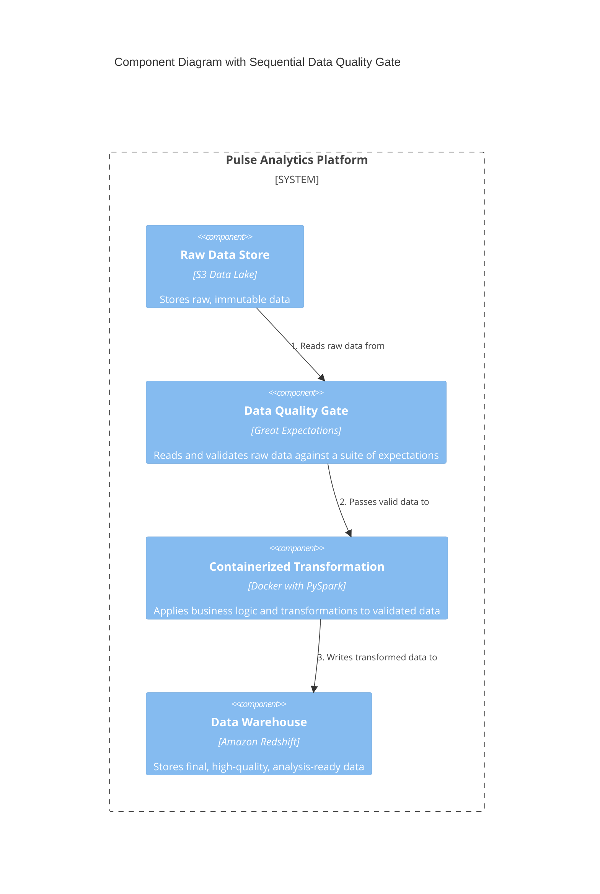
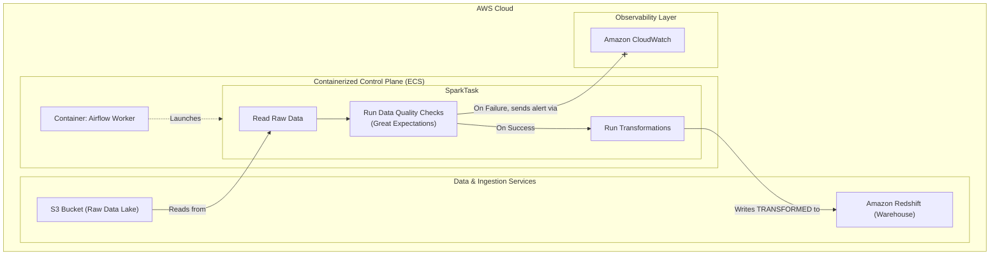

#### **1. Logical View: C4 Component Diagram**

The logical diagram is updated to show the `Data Quality Gate` as a new, explicit step in the process, making it a first-class citizen of the architecture.

#### **2. Physical View: Mapping to AWS Resources**

The new logical component is implemented as a library within our existing container.

| C4 Component                 | AWS Resource / Tool                              | Rationale for Selection                                                                                                                              |
| ---------------------------- | ------------------------------------------------ | ---------------------------------------------------------------------------------------------------------------------------------------------------- |
| ... (Previous Components) ... | ... (Previous Resources) ...                     | ... (No change) ...                                                                                                                                  |
| **Data Quality Gate**        | Great Expectations (Python Library)              | The leading open-source tool for data validation. It allows for expressive, declarative data tests that can be version-controlled alongside our Spark code. It integrates natively with Spark DataFrames. |

#### **3. Physical View: AWS Deployment Diagram**

The physical diagram is updated to show the new validation step within the Spark job's execution flow.

