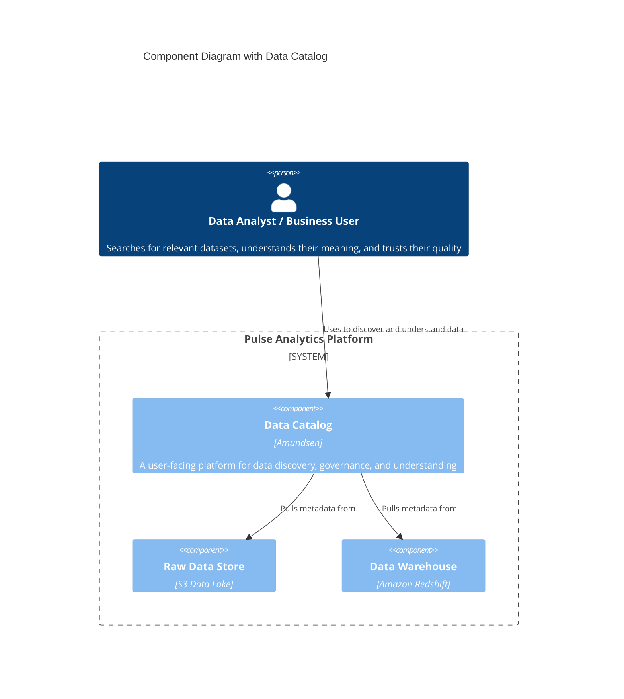
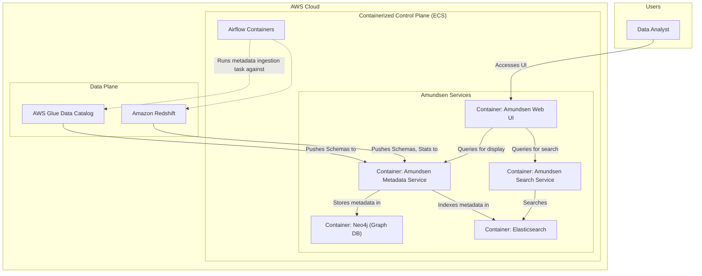

#### **1. Logical View: C4 Component Diagram**

The logical diagram introduces the `Data Catalog` as a central system that users interact with to *learn about* the data in our storage layers.

#### **2. Physical View: Mapping to AWS Resources**

The new logical component is implemented as a suite of containerized services running on our existing ECS cluster.

| C4 Component                 | AWS Resource / Tool                              | Rationale for Selection                                                                                                                              |
| ---------------------------- | ------------------------------------------------ | ---------------------------------------------------------------------------------------------------------------------------------------------------- |
| ... (Previous Components) ... | ... (Previous Resources) ...                     | ... (No change) ...                                                                                                                                  |
| **Data Catalog**             | Amundsen on Amazon ECS (Fargate)                 | A leading open-source data catalog with a strong focus on user experience and data discovery. Deploying it on our existing ECS cluster leverages our container-based strategy. |

#### **3. Physical View: AWS Deployment Diagram**

The physical diagram shows the new Amundsen containers on the ECS cluster and, crucially, the flow of *metadata* (not business data) from our data stores into the catalog.

