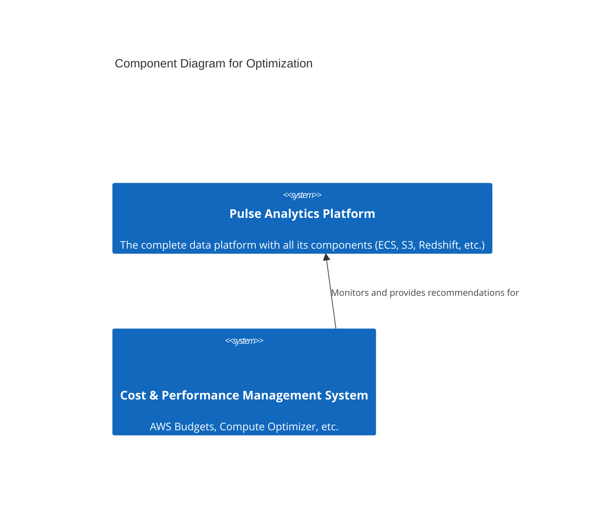
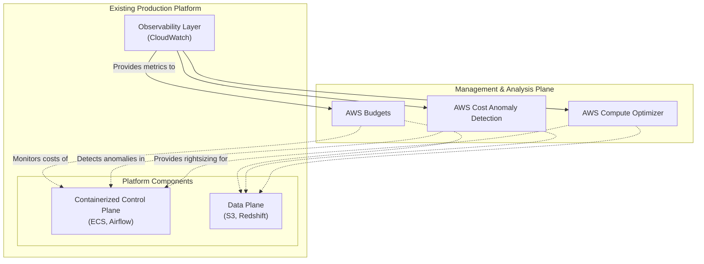

#### **1. Logical View: C4 Component Diagram**

Optimization is a cross-cutting concern managed by a set of tools and processes that observe the entire system.

#### **2. Physical View: Mapping to AWS Resources**

This issue doesn't add new runtime components to the pipeline but rather introduces management and analysis services.

| C4 Component | AWS Resource | Rationale for Selection |
| :--- | :--- | :--- |
| **Cost & Performance Management System** | AWS Budgets, AWS Cost Anomaly Detection, AWS Compute Optimizer | These are native AWS management tools designed specifically for monitoring and optimizing cost and resource utilization within an AWS environment, providing actionable recommendations. |

#### **3. Physical View: AWS Deployment Diagram**

This diagram shows how the management services interact with our existing platform to provide insights and control.

